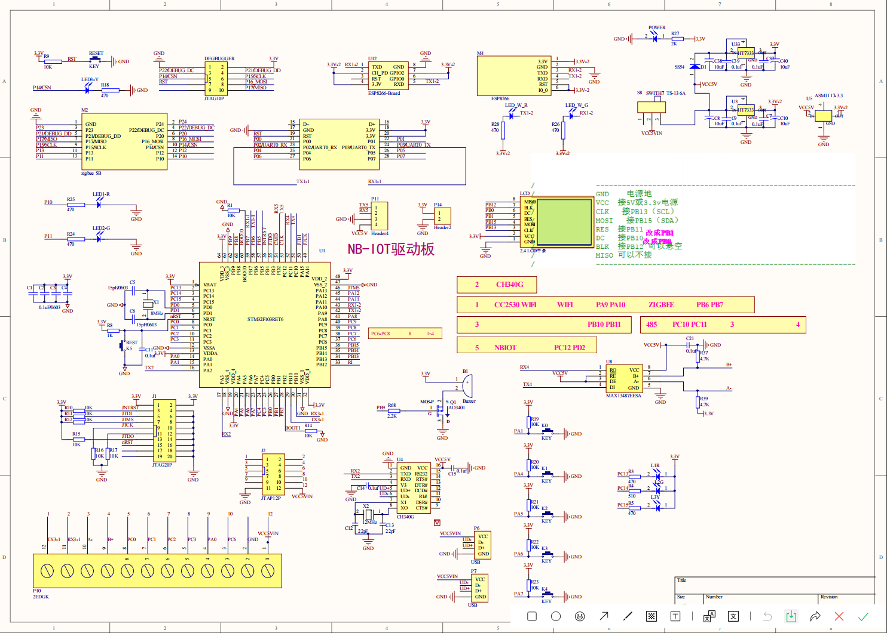
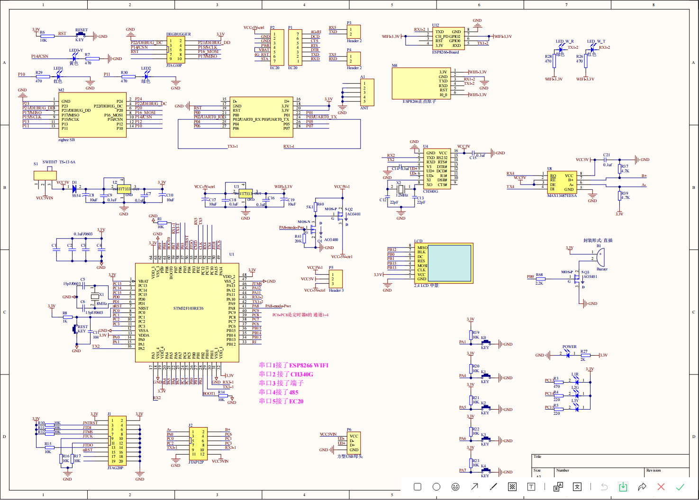
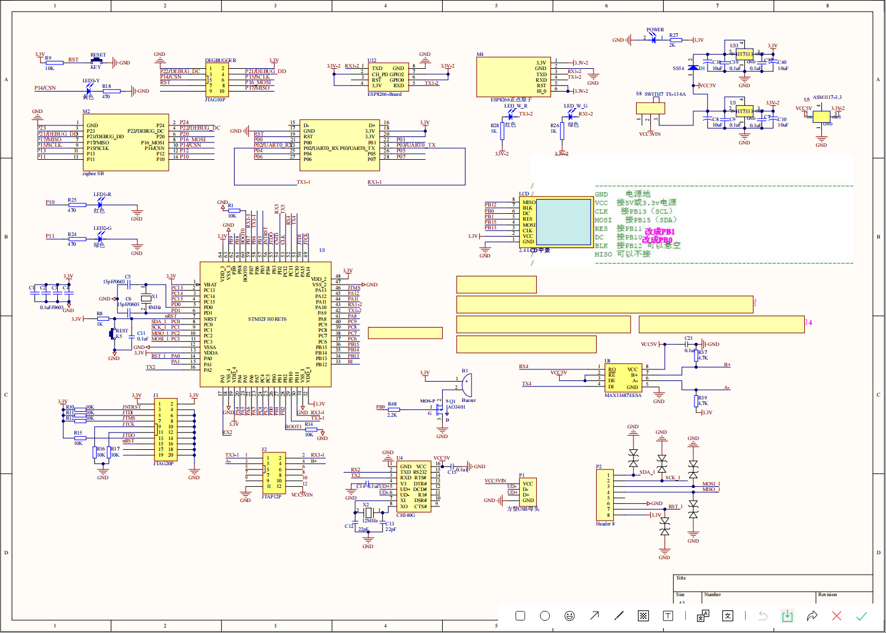
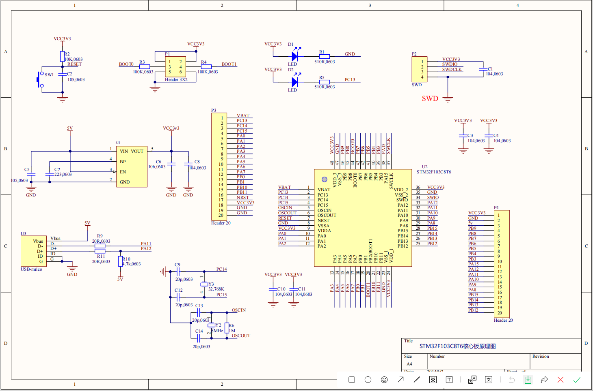
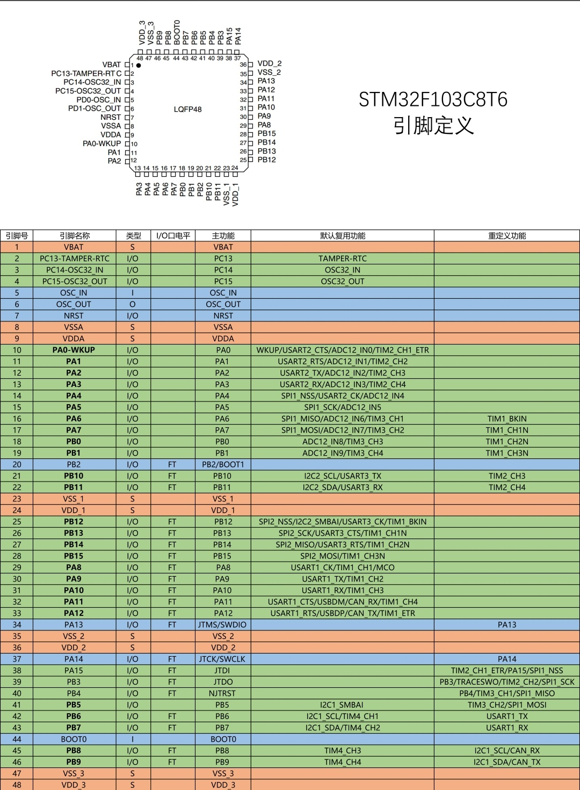

# stm32f103c8t6/zet6

### Introduction
Record STM32 learning process

#### Software architecture
KELI5 MDK

#### Instructions for use

1. git clone project
2. Open PRJ/ click the green icon.
3. enjoy！

#### stm32f103ret6 training platform node schematic diagram

1. Schematic diagram of training platform node

2. Schematic diagram of 4G node

3. Schematic diagram of RFID node

#### Schematic diagram of minimum system board of stm32f103c8t6

#### Schematic diagram:

#### Pin Definition Diagram:

